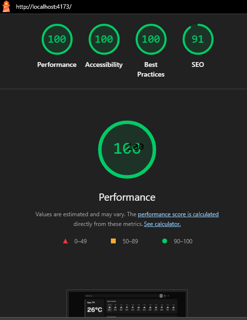
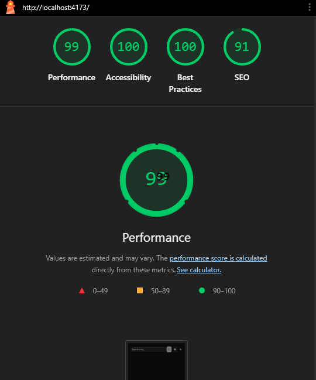

# Weather App

A real-time weather application built with React and TypeScript. Features geolocation, city search, animated weather icons, dark/light mode, and auto-refresh — designed as a portfolio project demonstrating clean API integration and component architecture.

**[Live Demo →](https://your-app.vercel.app)** _(link updated after deployment)_




---

## Tech Stack

| Category | Technology |
|----------|------------|
| Framework | React 19 |
| Language | TypeScript (strict mode, zero `any`) |
| UI Components | ShadCN UI (Radix primitives) |
| Styling | Tailwind CSS v4 |
| Build Tool | Vite 8 |
| Weather API | OpenWeatherMap (free tier) |
| Deployment | Vercel / Netlify |

---

## Features

- **Geolocation** — auto-detects your location on load
- **City Search** — search any city by name
- **Current Conditions** — temperature, humidity, wind speed, condition description
- **Hourly Forecast** — 12-hour horizontal scroll strip
- **5-Day Forecast** — daily high/low with precipitation probability
- **Animated Icons** — condition-responsive weather icons
- **Dark / Light Mode** — toggle with persistent localStorage preference
- **Auto-Refresh** — updates every 10 minutes; re-fetches on tab focus if stale
- **4 Error States** — city not found, API error, geolocation denied, no network
- **Responsive** — single column on mobile, side-by-side on tablet+
- **Accessible** — WCAG 2.1 AA compliant, keyboard-navigable, screen-reader-friendly

---

## Getting Started

### Prerequisites

- Node.js 18+ and npm
- A free [OpenWeatherMap API key](https://openweathermap.org/api) (sign up → API keys tab)

### Setup

```bash
# 1. Clone the repository
git clone https://github.com/Jistir03/Weather-App.git
cd Weather-App

# 2. Install dependencies
npm install

# 3. Configure environment
cp .env.example .env.local      # Windows: copy .env.example .env.local
# Edit .env.local and replace 'your_key_here' with your OWM API key

# 4. Start development server
npm run dev
```

Open [http://localhost:5173](http://localhost:5173) in your browser.

---

## Deployment

### Vercel (Recommended)

1. Push this repo to GitHub
2. Go to [vercel.com](https://vercel.com) → New Project → Import your repo
3. Vercel auto-detects Vite — no build configuration needed
4. Add environment variable: `VITE_OWM_API_KEY` = your API key
5. Click Deploy

### Netlify

1. Push this repo to GitHub
2. Go to [netlify.com](https://netlify.com) → New site → Import from Git
3. Build command: `npm run build`, Publish directory: `dist`
4. Site settings → Environment variables → Add `VITE_OWM_API_KEY` = your API key
5. Trigger deploy

---

## API Key Security

The OpenWeatherMap API key is embedded in the client-side JavaScript bundle (this is standard for public weather APIs on free tier). To prevent abuse:

1. Log in to [openweathermap.org](https://openweathermap.org)
2. Go to API keys → Edit your key
3. Under **Allowed referrers**, add your deployed domain: `https://your-app.vercel.app`
4. Click **Save**
5. This prevents the key from being used from other domains

**Note:** The key is intentionally visible in the bundle — OWM free tier keys are rate-limited and designed for client-side use. Never use a paid production key in a public client-side app.

---

## Project Structure

```
src/
├── components/    # React UI components
│   └── ui/        # ShadCN generated components
├── hooks/         # Custom React hooks (useWeather, useGeolocation)
├── services/      # API layer (weatherApi.ts — OWM integration)
├── types/         # TypeScript interfaces (owm.ts, weather.ts)
├── lib/           # Utilities (mapConditionCode, formatDate, motion)
└── context/       # React contexts (ThemeContext)
```

---

## License

MIT — feel free to use as a portfolio project template.
